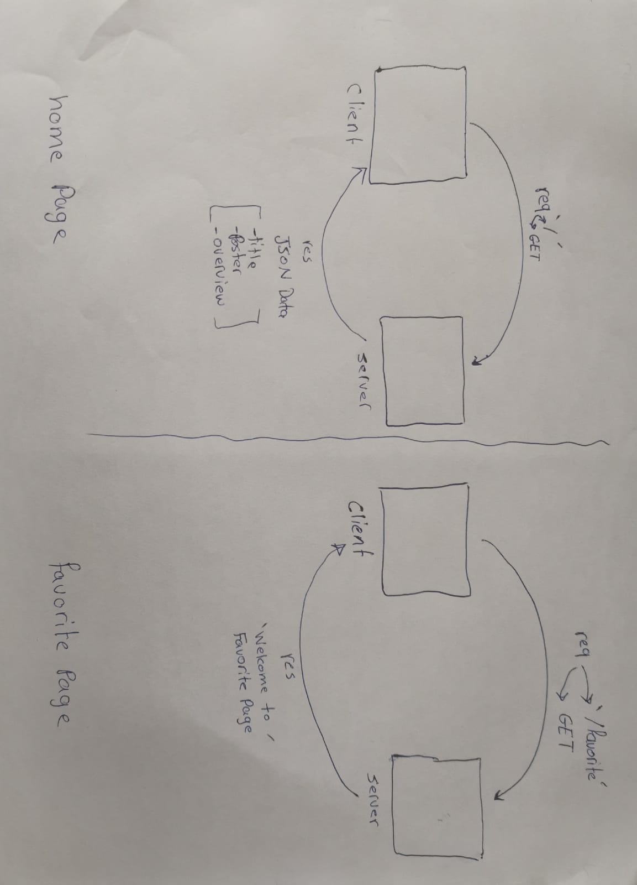

# Movies-Library - V.1

**Author Name**: Husam Hasan Obeidat

## WRRC

## Overview

## Getting Started

1- require express framework.

2- create a port.

3- make the server listen to the port we have created.

4- created a route for home page.

5- created a handler for home page to retrieve data later on .

6- created a route for favorite page.

7- created a handler for favorite page "only welcoming msg" .

8- created a constructor to pass the data.json to it ("title , poster , overview).

9- used the home page handler to retrieve the requested data .

10- used the app.use() method to create an error handling function for server error.

11- used the app.use() method to create an error handling function for "page not found error".

## Project Features
retrieve a movie information from data.json
inside the home page "/"    {movie title , movie poster , movie overview}
inside the favorite page "/favorite"   {welcoming message}