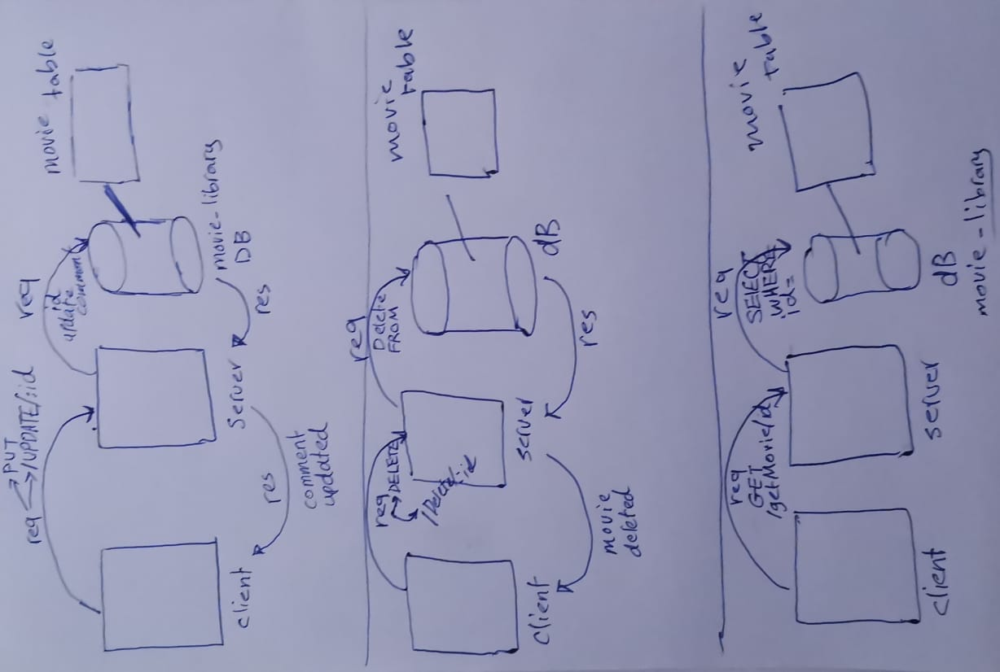

# Movies-Library - V.1

**Author Name**: Husam Hasan Obeidat

## WRRC

## Overview

## Getting Started

1- require express framework.

2- create a port.

3- make the server listen to the port we have created.

4- created a route for home page.

5- created a handler for home page to retrieve data later on .

6- created a route for favorite page.

7- created a handler for favorite page "only welcoming msg" .

8- created a constructor to pass the data.json to it ("title , poster , overview).

9- used the home page handler to retrieve the requested data .

10- used the app.use() method to create an error handling function for server error.

11- used the app.use() method to create an error handling function for "page not found error".

## Project Features
retrieve a movie information from data.json
inside the home page "/"    {movie title , movie poster , movie overview}
inside the favorite page "/favorite"   {welcoming message}

---------------------------------------------------------------------------------------------------------------------------

# Movies-Library - V.1.1

**Author Name**: Husam Hasan Obeidat

## Overview

## Getting Started

1- /trending: Get the trending movies data from the Movie DB API (3rd party API) inside function trendingPageHandler.

2- created a constructor Trending to reshape the data.

3- /search: Search for a movie name to get its information using query from the Movie DB API (3rd party API) inside function searchHandler 

4- created a constructor Movie to reshape the data .

5- /popular: Get the Popular movies data from the Movie DB API (3rd party API) inside function popularHandler.

6- created a constructor Popular to reshape data .

7- /top-rated-tv-shows: Get the popular Tv-Shows from the Movie DB API (3rd party API) inside function tvShowsHandler.

8- created a constructor TV to reshape data .

## Project Features
retrieve data from a 3rd party API Movie DB
4 new routes 
user now can search for a movie using query .

---------------------------------------------------------------------------------------------------------------------------

# Movies-Library - V.1.2

**Author Name**: Husam Hasan Obeidat

## Overview

## Getting Started

1- /addMovie: Insert new movie information row {"title","Duration","Image"} inside function addMovieHandler() .

2- /getMovies: Return all the movies from DataBase "movies" inside function getMoviesHandler().

## Project Features
now a client can add/view items from a DB called movies.

---------------------------------------------------------------------------------------------------------

# Movies-Library - V.1.3

**Author Name**: Husam Hasan Obeidat

## Overview

## WRRC

## Getting Started

1- /UPDATE/:id : update comments on a movie by id inside function updateHandler() .

2- /DELETE/:id : deleteing movie from the database by id inside function deleteHandler().

3- /getMovie/:id : display a movie with the given id from the dataBase inside function getMovieByIdHandler().

## Project Features
now a client can Update/Delete items from a DB called movies.
